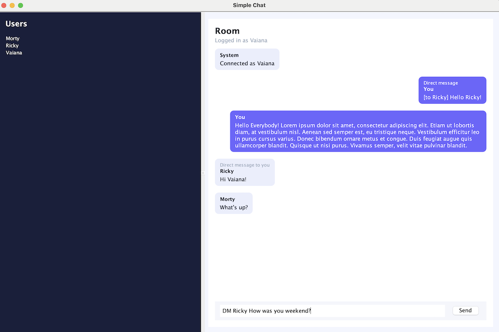

# Network Messenger – Server and Multiple Clients

## Project Assumptions

The goal of this project is to:

- Create a server application capable of handling multiple clients simultaneously
- Implement communication based on TCP sockets
- Develop a simple message exchange protocol
- Design a graphical user interface (GUI) for the client application

## Protocol
| Client Command         | Meaning                       | Server Response                                |
| ---------------------- | ----------------------------- | ---------------------------------------------- |
| `HELLO <nick>`         | connection, user registration | `WELCOME` / `ERROR ...`                        |
| `MSG <text>`           | public message                | server sends `FROM <nick> <text>` to all users |
| `PRIV <toNick> <text>` | private message               | server sends `PRIVFROM <fromNick> <text>`      |
| `USERS`                | list of online users          | `USERS <nick1,nick2,...>`                      |
| `QUIT`                 | end of session                | server closes the connection                   |

## How to run

Prerequisites:
- Java 21 (project uses Gradle toolchains to compile with Java 21)
- Use the included Gradle wrapper (`./gradlew`)

### Start the server (default entry point):
```bash
./gradlew run --args="5000"
```
Or use the convenience task:
```bash
./gradlew runServer
```

Launch the GUI client (Swing desktop app):
```bash
./gradlew runClient
```

Alternatively, from your IDE:
- Run `chat.server.ChatServer.main` to start the server (optionally pass a port argument, default 5000)
- Run `chat.app.ChatApp.main` to start the GUI client

Quick sanity checks
- Confirm it’s listening: `nc -zv localhost 5000`
- If you ever need to free the port manually: `lsof -nP -iTCP:5000 | grep LISTEN` then `kill -TERM <PID>`

## Using the GUI client (Swing)

What you’ll see and how to use it:
- Login prompt
    - When the client starts it immediately connects to `127.0.0.1:5000` and asks for a nickname.
    - Pick any nickname up to the limit shown. If the nick is taken or invalid, you’ll be asked again.
- Users list (left sidebar)
    - Shows everyone currently online. This is informational; sending a private message is done via the input field (see below).
- Sending public messages (room chat)
    - Type your message in the input box at the bottom and press Enter. Everyone will see it.
- Sending private/DM messages
    - Use the command: `DM <nick> <message>`
    - Example: `DM alice hi there!`
    - Your own DMs are shown with a small “[to <nick>] …” hint.
- Status/system messages
    - The chat area displays system events like connection, errors, and disconnects.
- Disconnecting
    - Closing the window logs you out and closes the connection.



## Tests

This project uses JUnit 5 (Jupiter) and Mockito. Tests are executed via the Gradle wrapper.

- Run all tests:
```bash
./gradlew test
```

- Run a single test class:
```bash
./gradlew test --tests "chat.server.ChatServerTest"
```

- Run one test method:
```bash
./gradlew test --tests "chat.server.ChatServerTest.usersListBroadcastsOnLoginAndLogout"
```

- Run tests matching a pattern (e.g., a package):
```bash
./gradlew test --tests "chat.server.*"
```

Where to find results:
- HTML report: `build/reports/tests/test/index.html`
- XML results: `build/test-results/test/`

Notes:
- The server tests bind to an ephemeral free port at runtime; no manual setup is required.
- Ensure no strict firewall rules block localhost TCP connections if tests are run in a restricted environment.
